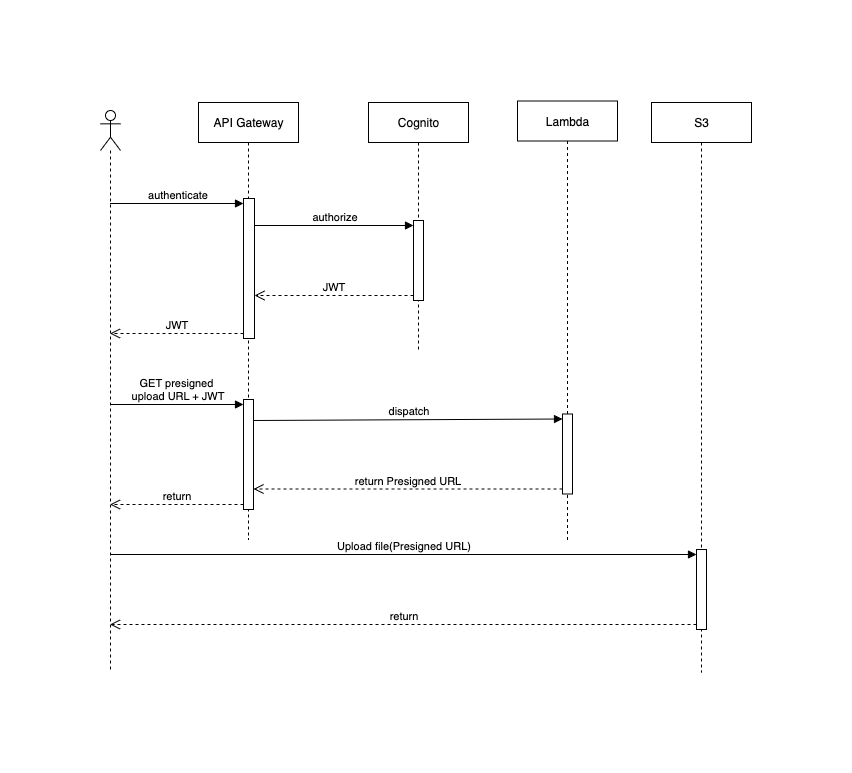
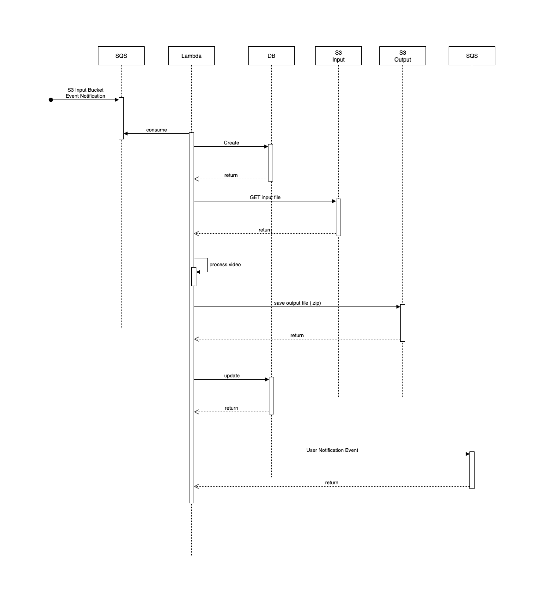
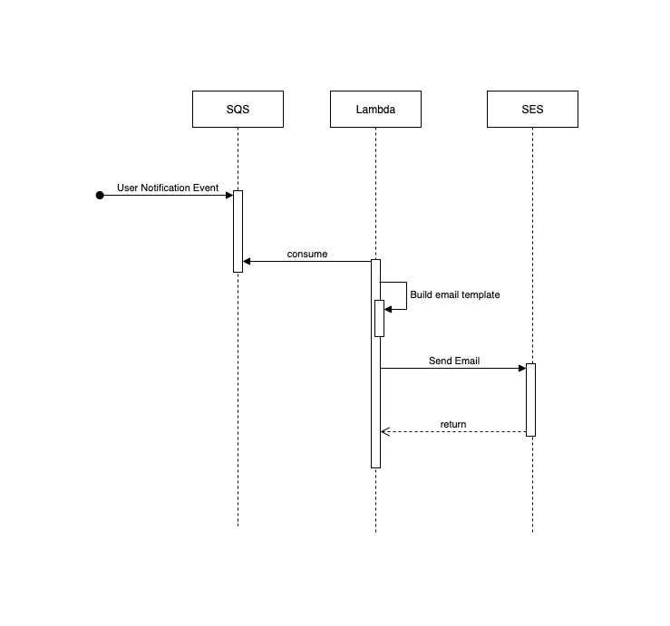
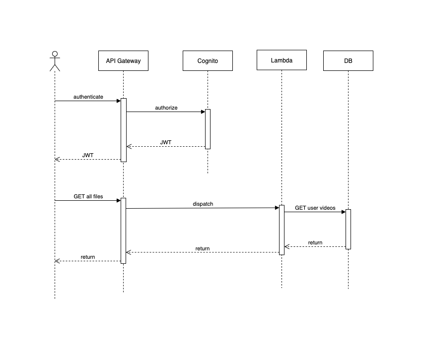

[](https://sonarcloud.io/summary/new_code?id=9SOAT_hackathon-lambda)
[](https://sonarcloud.io/summary/new_code?id=9SOAT_hackathon-lambda)
[](https://sonarcloud.io/summary/new_code?id=9SOAT_hackathon-lambda)
[](https://sonarcloud.io/summary/new_code?id=9SOAT_hackathon-lambda)
[](https://sonarcloud.io/summary/new_code?id=9SOAT_hackathon-lambda)


## Descrição do Projeto

Este projeto consiste em funções AWS Lambda desenvolvidas para fornecer serviços essenciais em uma arquitetura serverless. O sistema inclui várias funções que trabalham com serviços da AWS para entrega de e-mails, gerenciamento de uploads de arquivos, processamento de vídeos e muito mais.

### Funcionalidades

#### 1. Sistema de Notificação via E-mail (notification)
Uma função Lambda que processa mensagens de uma fila SQS e envia e-mails personalizados utilizando o Amazon SES (Simple Email Service). A função:

- Utiliza templates pré-configurados no SES para envio de e-mails
- Suporta personalização de mensagens através de placeholders
- Processa mensagens de uma fila para comunicação assíncrona
- Fornece tratamento de erros e logs para rastreabilidade

#### 2. Gerador de URLs Pré-assinadas (presigned)
Uma função Lambda que gera URLs pré-assinadas do S3 para upload seguro de arquivos. A função:

- Gera URLs temporárias para upload direto ao S3, sem necessidade de credenciais AWS
- Utiliza autenticação JWT para validar solicitações
- Nomeia os arquivos com base no ID do usuário e timestamp
- Define políticas de expiração para os links gerados

#### 3. Pré-Cadastro de Usuários (pre_sign_up)
Uma função Lambda que é executada durante o processo de cadastro de novos usuários:

- Adiciona o e-mail do usuário aos claims do token de acesso
- Personaliza tokens de autenticação para melhor experiência do usuário
- Mantém a segurança e integridade dos dados do usuário

#### 4. Listagem de Vídeos (listing)
Uma função Lambda que lista vídeos disponíveis:

- Recupera metadados de vídeos armazenados
- Suporta filtragem e paginação
- Retorna dados estruturados para exibição na interface do usuário

#### 5. Processamento de Vídeos (processor)
Uma função Lambda que processa vídeos após o upload:

- Valida metadados e formato dos vídeos
- Realiza conversão e/ou otimização quando necessário
- Atualiza informações do vídeo no sistema de armazenamento

## Tecnologias Utilizadas

- **AWS Lambda** - Computação serverless para execução das funções
- **Amazon SES** - Serviço de envio de e-mails
- **Amazon S3** - Armazenamento de objetos
- **Amazon SQS** - Filas de mensagens para processamento assíncrono
- **Amazon Cognito** - Autenticação e gerenciamento de usuários
- **Python** - Linguagem de programação utilizada
- **Boto3** - SDK AWS para Python
- **JWT** - Autenticação baseada em tokens
- **pytest** - Framework para testes unitários

## Como Usar

### Pré-requisitos
- Conta AWS com acesso aos serviços: Lambda, SES, S3, SQS e Cognito
- Python 3.8 ou superior
- Boto3 instalado

### Configuração da Função de Notificação
1. Crie templates de e-mail no Amazon SES
2. Configure uma fila SQS como trigger para a função Lambda
3. As mensagens devem seguir o formato:
   ```json
   {
     "receiver_email": "destinatario@exemplo.com",
     "sender_email": "remetente@exemplo.com", 
     "template_name": "nome_do_template",
     "placeholders": { 
       "chave1": "valor1",
       "chave2": "valor2"
     }
   }
   ```

### Configuração da Função de URLs Pré-assinadas
1. Configure a variável de ambiente `BUCKET_NAME` com o nome do bucket S3
2. Configure um autorizador JWT no API Gateway
3. O endpoint retornará um URL pré-assinado válido por 1 hora

### Configuração da Função de Pré-Cadastro
1. Integre a função com o fluxo de cadastro do Amazon Cognito
2. A função é executada automaticamente durante o processo de cadastro
3. Não são necessárias configurações adicionais

### Configuração da Função de Listagem
1. Configure as permissões de acesso aos recursos necessários
2. Integre com uma API Gateway para acesso externo
3. Defina parâmetros de paginação conforme necessário

### Configuração da Função de Processamento
1. Configure triggers para execução automática após uploads
2. Defina permissões adequadas para acesso aos recursos de armazenamento
3. Configure variáveis de ambiente conforme necessário para o processamento

## Arquitetura da Solução

O sistema implementa uma arquitetura serverless completa para processamento e distribuição de vídeos:

### URL Pré-assinada


### Processamento de Vídeo


### Notificação por Email


### Listagem de Vídeos



## Estrutura do Projeto
```
hackathon-lambda/
│
├── notification/        # Função Lambda para notificações via e-mail
│   ├── main.py          # Código principal
│   ├── requirements.txt # Dependências
│   └── test_main.py     # Testes unitários
│
├── presigned/           # Função Lambda para geração de URLs pré-assinadas
│   ├── lambda_function.py # Código principal
│   ├── requirements.txt # Dependências
│   └── test_lambda_function.py # Testes unitários
│
├── pre_sign_up/         # Função Lambda para pré-cadastro de usuários
│   ├── lambda_pre_sign_up.py # Código principal
│   ├── requirements.txt # Dependências
│   └── test_lambda_pre_sign_up.py # Testes unitários
│
├── listing/             # Função Lambda para listagem de vídeos
│   ├── lambda_listing.py # Código principal
│   ├── requirements.txt # Dependências
│   └── test_lambda_listing.py # Testes unitários
│
├── processor/           # Função Lambda para processamento de vídeos
│   ├── lambda_processor.py # Código principal
│   ├── requirements.txt # Dependências
│   └── test_lambda_processor.py # Testes unitários
│
└── docs/                # Documentação e diagramas
    ├── email_notification.png
    ├── list_videos.png
    ├── presigned_url.png
    └── video_processing.png
```

## Implantação

Para implantar as funções Lambda:

1. Configure suas credenciais AWS
2. Prepare o pacote de implantação para cada função incluindo suas dependências:
   ```bash
   pip install -r requirements.txt -t .
   zip -r function.zip .
   ```
3. Faça upload do código para o AWS Lambda através do console ou usando a AWS CLI:
   ```bash
   aws lambda update-function-code --function-name MinhaFuncao --zip-file fileb://function.zip
   ```
4. Configure os triggers e permissões necessárias para cada função

## Testes

Execute os testes unitários para verificar o funcionamento das funções:

```bash
pytest
```

Para testar uma função específica:

```bash
cd notification
pytest test_main.py
```

## Contribuição

1. Faça um fork do projeto
2. Crie uma branch para sua feature (`git checkout -b feature/nova-funcionalidade`)
3. Commit suas mudanças (`git commit -m 'Adiciona nova funcionalidade'`)
4. Push para a branch (`git push origin feature/nova-funcionalidade`)
5. Abra um Pull Request

## Licença

Este projeto está licenciado sob a licença MIT - veja o arquivo LICENSE para mais detalhes.

## Equipe

Desenvolvido pela equipe SOAT (Software Architecture) durante o Hackathon 2025.
